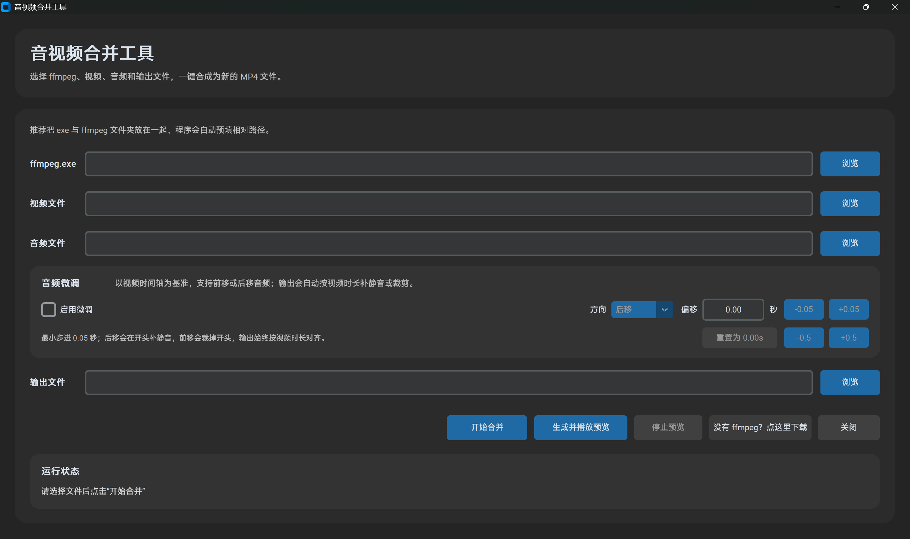

# 音视频合并工具

[简体中文](README.md) | [English](README.en.md)

用于将独立音频与无声视频合并为 MP4 的 Windows 桌面工具。



## 项目背景
我在下载某站的视频素材时，发现部分网页媒体会将画面和声音分别保存为两个独立的 `.m4s` 文件：
- 一个文件只包含视频画面，没有声音；
- 另一个文件只包含音频，没有画面。
每次通过 FFmpeg 命令行手动合并比较麻烦，因此我制作了这个工具。
只需要选择视频文件、音频文件和输出位置，即可将二者合并为 MP4 文件。
本工具只处理用户在本地选择的媒体文件，不提供网页解析、视频抓取、账号登录、访问控制绕过或数字版权保护规避功能。

## 合法使用声明
请仅使用本工具处理以下内容：
- 由你本人创作的媒体；
- 已获得版权所有者明确授权的媒体；
- 允许下载、备份或二次处理的媒体；
- 公共领域或法律法规允许使用的媒体。
用户应自行遵守媒体来源网站的服务条款及适用的著作权法律。
本项目不鼓励也不支持未经授权下载、传播或商业使用受版权保护的内容。

## 系统要求
- Windows 10/11 64 位
- 首次下载 FFmpeg 时需要联网

## 主要功能
- 支持 M4S、MP4、MP3、AAC、WAV 等格式
- 合并音频和无声视频
- 支持音频时间微调
- 支持生成并播放预览
- 输出 MP4 文件

## 安装与使用
1. 从本仓库的 Releases 页面下载 EXE。
2. 把 EXE 放进一个单独文件夹，不要直接长期放在“下载”目录。
3. 启动程序。
4. 如果没有 FFmpeg，点击程序中的下载按钮。
5. 选择视频、音频和输出文件。
6. 点击“开始合并”。

## 关于 FFmpeg
本 Release 不包含 FFmpeg 二进制。
只有用户主动点击下载按钮后，程序才会从以下第三方网站下载：
https://www.gyan.dev/ffmpeg/builds/
FFmpeg 项目：
https://ffmpeg.org/
FFmpeg 使用自己的独立许可证。本项目与 FFmpeg 项目及
Gyan FFmpeg Builds 无隶属或官方合作关系。

## 数字签名说明
当前测试版本尚未使用商业代码签名证书。
Windows 可能显示“未知发布者”或 SmartScreen 提示。
请只从本仓库的 Releases 页面下载，并核对 SHA-256。
不要从其他网站、网盘或聊天群下载重新打包的版本。

## 安全校验
PowerShell 校验命令：
```powershell
Get-FileHash ".\merge_audio_video_gui-v1.0.0-beta.1-windows-x64.exe" -Algorithm SHA256
```
